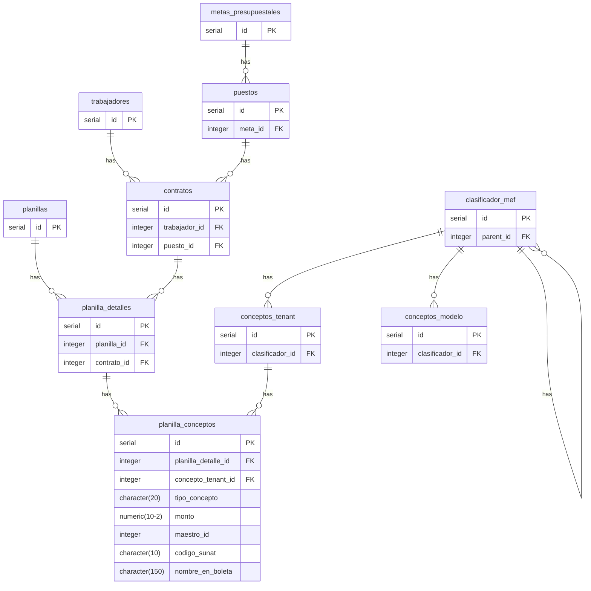

## Para anexo 1. Detalle del Compromiso Presupuestal
El siguiente diagrama `mermaid` podemos apreciar las relaciones entre tablas para Planillas, metas, clasificadores y conceptos tenant:

El detalle del compromiso presupuestal es la tabla ordenada que relaciona la meta presupuestal, el clasificador presupuestal de gasto y el monto total a nivel de clasificador de gasto de la planilla de un periodo generado, para realizar el registro SIAF correspondiente de la fase de compromiso mensual.

Para una planilla de un periodo determinado nuestra primera versión debe quedar algo así:

| meta | clasificador | descripción del clasificador |    monto |
| :--: | ------------ | ---------------------------- | -------: |
| 0001 | 2.1.1.1.1.1  | FUNCIONARIOS ELEGIDOS POR ELECCION POLITICA | 3,000.00 |
| 0001 | 2.1.3.1.1.14 | CONTRIBUCIONES A ESSALUD DE REGÍMENES ESPECIALES Y OTROS REGÍMENES |   270.00 |
| 0003 | 2.1.1.1.1.2  |  PERSONAL ADMINISTRATIVO NOMBRADO (REGIMEN PUBLICO) | 4,368.60 |
| 0003 | 2.1.3.1.1.13 | CONTRIBUCIONES A ESSALUD DEL PERSONAL ADMINISTRATIVO |   393.17 |

### Anotaciones Adicionales:
1. En el repositorio al obtener las filas para el compromiso presupuestal (en `AnexoRepository.ObtenerCompromisoPresupuestal`), debemos filtrar el tipo de concepto (`planillas_conceptos.tipo_concepto`) excluyendo el tipo `RETENCION` de la consulta.
2. El **problema del descuento por redondeo** de ONP, renta de 4ta y renta de 5ta. Debemos seguir el siguiente procedimiento:
	1. Calcular los montos de "Ajuste de redondeo" de ONP, renta de 4ta y renta de 5ta, que corresponden a los conceptos tenant: "SNP DL 19990 - ONP", "Renta de Cuarta Categoría - Retenciones" y "Renta de Quinta Categoría - Retenciones" de la planilla del periodo de trabajo. Se pueden calcular así:
		1. Ajuste redondeo ONP = Redondear(sumatoria(SNP DL 19990 - ONP)) - sumatoria(SNP DL 19990 - ONP).
		2. Ajuste redondeo Renta de 4ta Categoría = Redondear(sumatoria(Renta de Cuarta Categoría - Retenciones)) - sumatoria(Renta de Cuarta Categoría - Retenciones).
		3. Ajuste redondeo Renta de 5ta Categoría = Redondear(sumatoria(Renta de Quinta Categoría - Retenciones)) - sumatoria(Renta de Quinta Categoría - Retenciones).
	2. Identificar al menos una meta presupuestal donde exista el concepto tenant que se debe ajustar. Se puede identificar esta relación en el gráfico `mermaid` anterior. Por ejemplo, si el puesto "A", asociado a la **meta 0001**, tiene el concepto tenant "SNP DL 19990 - ONP", entonces la meta 0001 es nuestro objetivo para sumar el monto de "ajuste redondeo ONP", pero antes necesitamos identificar un clasificador de gasto que se combine con la meta para aplicar la suma del ajuste.
	3. Aunque nos produzca un pequeño esfuerzo de cálculo necesitamos obtener el clasificador de gasto adecuado dentro de la meta identificada en el paso anterior, debemos seguir los siguientes pasos:
		1. Identificar los clasificadores de los conceptos tenant con la propiedad (columna) `es_remunerativa` sea verdadero y que esté asociado a la propiedad `tipo_concepto=INGRESO` en la tabla `planilla_conceptos` (ver el gráfico `mermaid` anterior) y será necesario completar la consulta para obtener las metas presupuestales. Es decir, en este paso debemos conocer en una consulta: meta presupuestal, tipo_concepto (INGRESO), concepto tenant (es_remunerativa=Verdadero) y clasificador.
		2. De la consulta anterior podemos filtrar la meta presupuestal identificada para los ajustes de redondeo (ONP, Renta de 4ta o Renta de 5ta) y elegir uno de los clasificadores sobre el cual se aplicará la suma del ajuste de redondeo. En este punto ya tenemos identificado la meta presupuestal y el clasificador que necesitamos.
	4. Finalmente, de la tabla final que construimos utilizando `AnexoRepository.ObtenerCompromisoPresupuestal` antes del renderizado final ejecutamos la suma de los ajustes de redondeo a las metas y clasificadores identificados en el punto anterior, siempre y cuando esta suma no produzca un monto negativo.