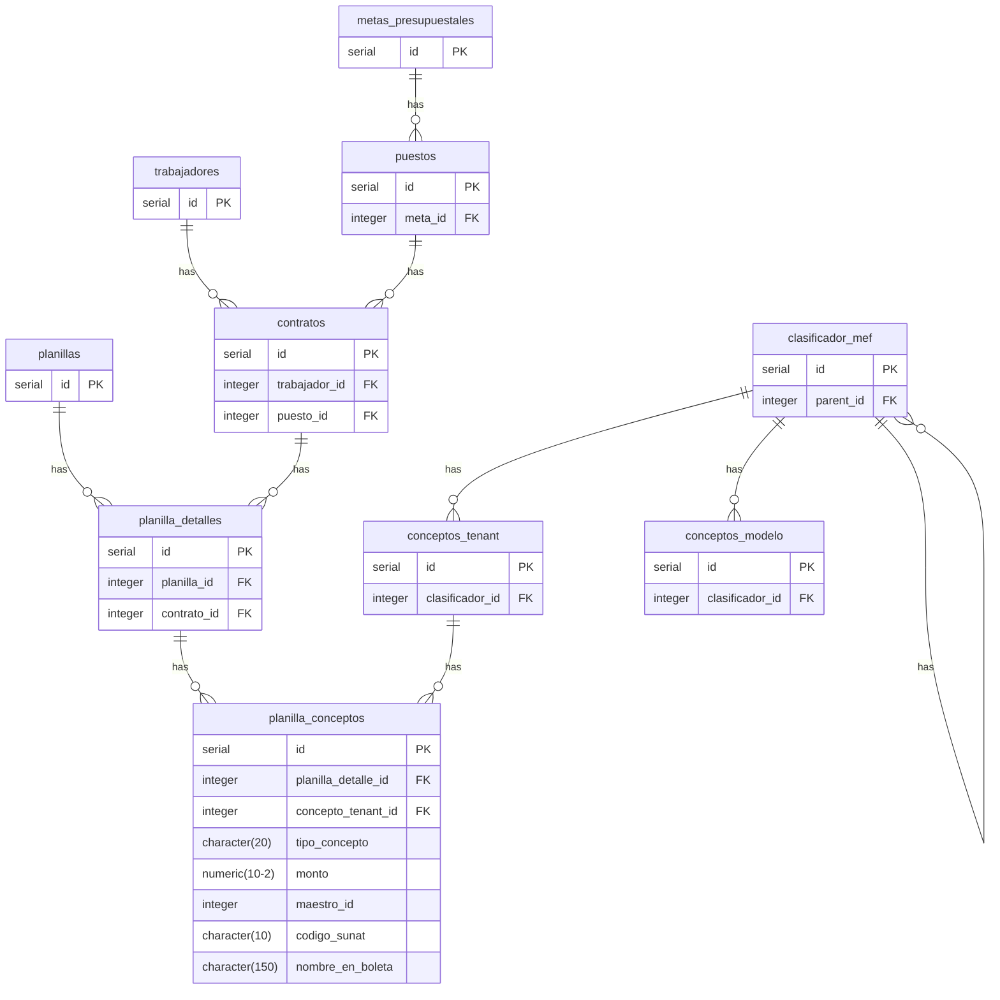

# Sobre el Anexo 1A de la planilla

## El Anexo 1A Resumen por conceptos de planilla
Está referido a un informe donde se pueden observar los conceptos de la planilla en el periodo de trabajo, organizados por tipo de concepto (INGRESO, RETENCIÓN Y APORTE), totalizados a nivel de conceptos y de tipo de concepto, que deben sumar el "monto total de la planilla" (Recuerda que solo debemos sumar INGRESO y APORTE).

Los ajustes de redondeo (ONP, renta de 4ta y renta de 5ta) deben sumarse directamente a los totales de los conceptos tenant: "SNP DL 19990 - ONP" (0607), "Renta de Cuarta Categoría - Retenciones" (S101) y "Renta de Quinta Categoría - Retenciones" (0605), de tal manera que el total muestre el "Costo Total de la Planilla".

### Diagrama de relaciones entre tablas

