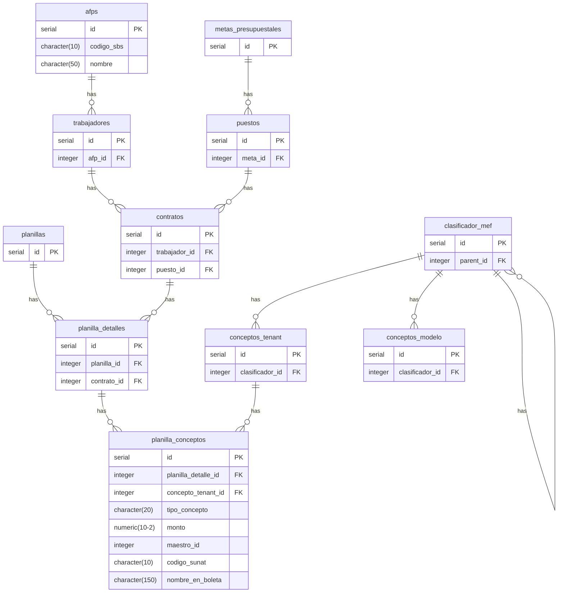

# Sobre el Anexo 2 Resumen por AFP y Anexo 2A Registro Devengado de AFP

El **Anexo 2 debe la tabla Resumen por AFP** se refiere a la información de afps y los conceptos de retención de afp.

El **Anexo 2A Registro Devengado de AFP** se refiere a una tabla de metas, clasificadores y monto (fitlrato para afps) para facilitar realizar el registro de devengado en el SIAF.

### Anexo 2 Resumen por AFP
Debe presentarse una tabla que resuma la información de los montos de las AFPS y los conceptos (tenant) relacionados:

1. SPP - Aporte Obligatorio AFP (código sunat: 0608). Palabras clave "Aporte Obligatorio AFP".
2. SPP - Comisión AFP (código sunat: 0601). Palabras clave "Comisión AFP".
3. SPP - Prima Seguro AFP (código sunat: 0606). Palabras clave "Prima Seguro AFP".

El modelo de tabla es así (falta la fila de totales):

| AFP       | Aporte Obligatorio AFP (0608) | Comisión AFP (0601) | Prima Seguro AFP (0606) | Total S/ |
| --------- | ----------------------------: | ------------------: | ----------------------: | -------: |
| HABITAT   |                        900.00 |                0.00 |                   34.98 |   934.98 |
| INTEGRA   |                      2,105.40 |                0.00 |                   93.36 | 2,198.76 |
| PRIMA     |                        360.00 |               18.60 |                   31.80 |   410.40 |
| PROFUTURO |                        840.00 |               26.88 |                   56.85 |   923.73 |

### Anexo 2A Registro Devengado de AFP
Para expresar de una manera fácil (para mi como humano) cómo obtener la información a mostrar de este anexo se debería hacer lo siguiente:

- De la información presentada en el **Anexo 1 Detalle del Compromiso Presupuestal** filtrar las metas y clasificadores que tengan una relación con las AFP (ver el diagrama `mermaid` de arriba).
- El resultado del monto final debe ser igual al del **anexo 2 resumen por AFP**.

La tabla de resultados de ejemplo es la siguiente (falta la fila de totales):

| meta      | clasificador | descripción del clasificador                                 | Aporte Obligatorio AFP (0608) | Comisión AFP (0601) | Prima Seguro AFP (0606) | Total S/ |
| --------- | ------------ | ------------------------------------------------------------ | ----------------------------- | ------------------- | ----------------------- | -------- |
| HABITAT   |              |                                                              |                               |                     |                         |          |
| 0002      | 2.1.1 1.1 2  | PERSONAL ADMINISTRATIVO NOMBRADO (REGIMEN PUBLICO)           | 900.00                        | 0.00                | 34.98                   | 934.98   |
| INTEGRA   |              |                                                              |                               |                     |                         |          |
| 0001      | 2.1.1 1.1 1  | FUNCIONARIOS ELEGIDOS POR ELECCION POLITICA                  | 900.00                        | 0.00                | 34.97                   | 934.98   |
| 0002      | 2.1.1 1.1 3  | PERSONAL CON CONTRATO A PLAZO FIJO (REGIMEN LABORAL PUBLICO) | 845.40                        | 0.00                | 31.50                   | 876.90   |
| 0003      | 2.1.1 1.1 3  | PERSONAL CON CONTRATO A PLAZO FIJO (REGIMEN LABORAL PUBLICO) | 360.00                        | 0.00                | 26.88                   | 386.88   |
| PRIMA     |              |                                                              |                               |                     |                         |          |
| 0005      | 2.1.1 1.1 2  | PERSONAL ADMINISTRATIVO NOMBRADO (REGIMEN PUBLICO)           | 360.00                        | 18.60               | 31.80                   | 410.40   |
| PROFUTURO |              |                                                              |                               |                     |                         |          |
| 0006      | 2.1.1 13.1 2 | CONTRATO ADMINISTRATIVO DE SERVICIOS - TRANSITORIO           | 840.00                        | 26.88               | 56.85                   | 923.73   |
