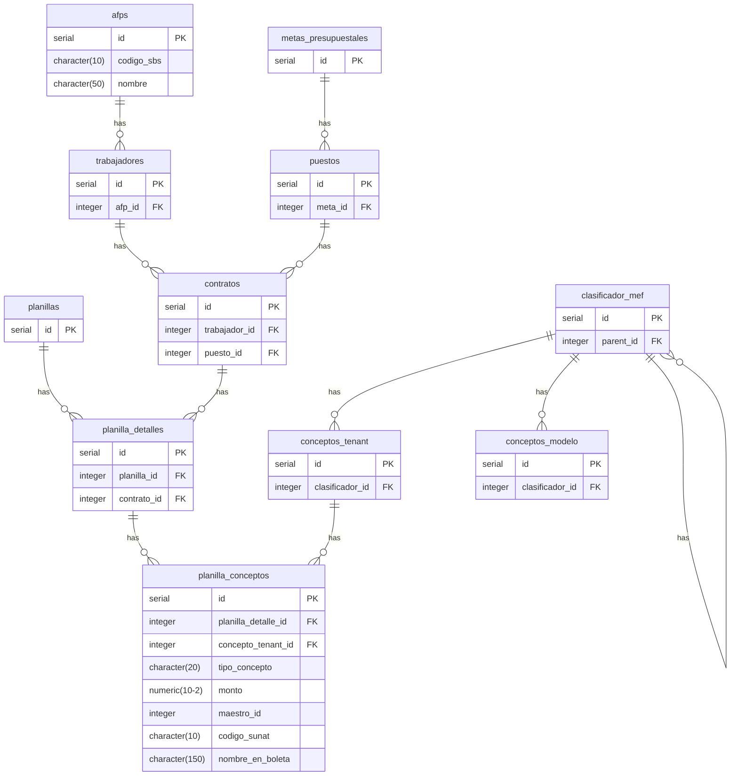

## Diagrama de relaciones de las tablas

## Anexo 3 Retenciones de SUNAT
Este anexo debe mostrar el resumen totalizado de los siguientes conceptos (tenant) de la planilla de trabajo:

1. SNP DL 19990 - ONP (código sunat: 0607). Palabras clave "19990" y "ONP".
2. Renta de Cuarta Categoría - Retenciones (código sunat: S101). Palabras clave "cuarta".
3. Renta de Quinta Categoría - Retenciones (código sunat: 0605). Palabras clave "quinta".

La tabla también debe presentar la relación de los conceptos (tenant) de la planilla con metas y clasificadores. Es como filtrar los los datos del anexo 1 pero filtrados por los conceptos de ONP, renta de 4ta y renta de 5ta.

La tabla de ejemplo del anexo 3 se parece a este (falta la fila de totales al final):

| meta      | clasificador | descripción del clasificador                                 | ONP (0607) | Renta 4ta (S101) | Renta 5ta (0605) | Total S/ |
| --------- | ------------ | ------------------------------------------------------------ | ---------- | ---------------- | ---------------- | -------- |
| 0002      | 2.1.1 1.1 2  | PERSONAL ADMINISTRATIVO NOMBRADO (REGIMEN PUBLICO)           | 900.00     | 0.00             | 34.98            | 934.98   |
| 0001      | 2.1.1 1.1 1  | FUNCIONARIOS ELEGIDOS POR ELECCION POLITICA                  | 900.00     | 0.00             | 34.97            | 934.98   |
| 0002      | 2.1.1 1.1 3  | PERSONAL CON CONTRATO A PLAZO FIJO (REGIMEN LABORAL PUBLICO) | 845.40     | 0.00             | 31.50            | 876.90   |
| 0003      | 2.1.1 1.1 3  | PERSONAL CON CONTRATO A PLAZO FIJO (REGIMEN LABORAL PUBLICO) | 360.00     | 0.00             | 26.88            | 386.88   |
| 0005      | 2.1.1 1.1 2  | PERSONAL ADMINISTRATIVO NOMBRADO (REGIMEN PUBLICO)           | 360.00     | 18.60            | 31.80            | 410.40   |
| 0006      | 2.1.1 13.1 2 | CONTRATO ADMINISTRATIVO DE SERVICIOS - TRANSITORIO           | 840.00     | 26.88            | 56.85            | 923.73   |
