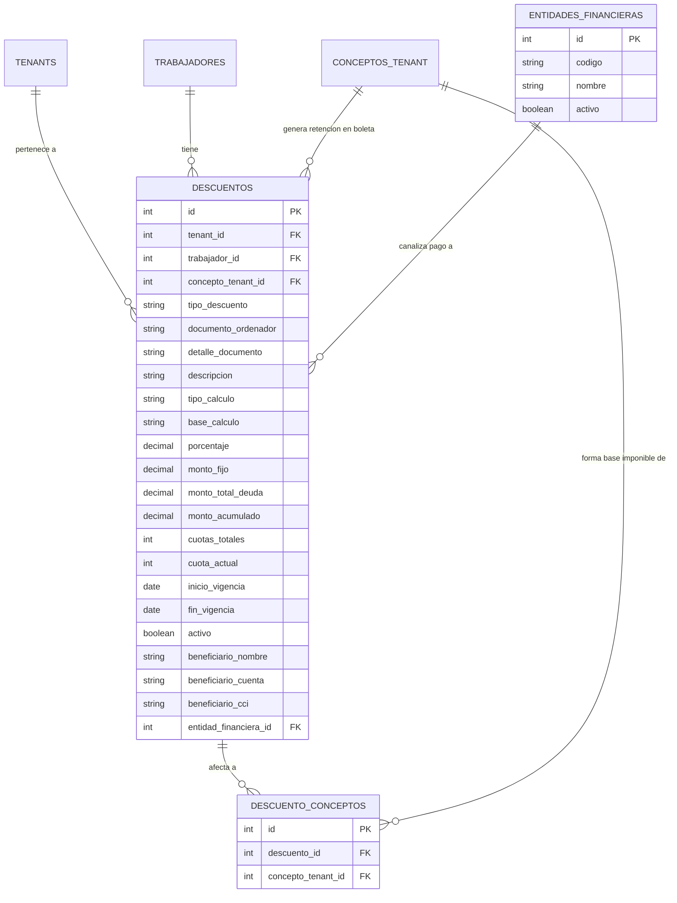

# Documento de Contexto y Especificación Técnica: Módulo de Descuentos y Retenciones Judiciales

## 1. Introducción y Marco Legal

En la gestión de planillas del sector público peruano (municipalidades, gobiernos regionales y ministerios), la administración de **retenciones judiciales y descuentos convencionales/voluntarios** es un proceso crítico de cumplimiento normativo y responsabilidad legal:

1. **Retenciones Judiciales por Alimentos (Código de los Niños y Adolescentes y Art. 648 inc. 6 del Código Procesal Civil):**
   - Son ordenadas mediante resolución judicial/mandato cautelar de juzgados de paz letrado o de familia.
   - Tienen prioridad absoluta sobre cualquier otro descuento convencional.
   - El límite legal inembargable establece que la retención puede ser de hasta el **60% del total de ingresos** con deducción previa de los tributos de ley (AFP, ONP, Renta de 5ta Categoría).
   - Suelen aplicarse sobre una base de conceptos específicos (por ejemplo: "Sueldo Básico + Asignación Familiar + Bonificaciones Permanentes + Gratificaciones") o de forma general sobre todo ingreso remunerativo.

2. **Retenciones Judiciales por Obligaciones Comerciales / Deudas (Embargos):**
   - Aplican sobre el excedente de 5 URP (Unidades de Referencia Procesal) y hasta 1/3 del exceso.

3. **Descuentos Sindicales (Cuota Sindical):**
   - Autorizados por ley y convenio colectivo (SUTRAMUN, SOMUN, SITRAMUN, etc.).
   - Generalmente calculados como un porcentaje fijo sobre el haber básico o un monto mensual predeterminado.

4. **Descuentos por Préstamos y Convenios:**
   - Créditos con entidades financieras (Banco de la Nación, Cajas Municipales) o cooperativas de trabajadores.
   - Manejan un plazo en cuotas y un monto total amortizable.

---

## 2. Diagnóstico del Modelo Propuesto y Mejoras Arquitectónicas

La propuesta original contenida en `docs/apuntes/retenciones_judiciales_y_descuentos.md` planteó una aproximación generalista adecuada, pero requería resolver puntos críticos de diseño:

| Aspecto | Propuesta Original | Solución Optimizada |
| :--- | :--- | :--- |
| **Definición de Tasas** | Duplicada en cabecera (`descuentos`) y detalle (`descuento_conceptos`). | Centralizada en la cabecera (`descuentos.tipo_calculo`: `PORCENTAJE` o `MONTO_FIJO`). En `descuento_conceptos` solo se seleccionan los conceptos que forman la base imponible. |
| **Base Imponible** | No especificaba si aplicaba sobre Bruto o Neto de Ley. | Campo `base_calculo`: `NETO_LEY` (ingresos afectos menos aportes obligatorios de ley) o `BRUTO_AFECTO` (suma directa). |
| **Concepto de Salida en Boleta / PLAME** | No vinculado a `conceptos_tenant`. | Clave foránea `concepto_tenant_id` vinculada a un concepto de tipo `RETENCION` con su respectivo código SUNAT (0703, 0704, 0708, 0709, etc.). |
| **Entidad Financiera** | `NOT NULL` obligatoria para todo tipo de descuento. | Opcional (`NULL`), permitiendo beneficiarios directos (juzgados, sindicatos, cuentas personales del alimentista). |
| **Control de Préstamos** | Solo vigencia por fechas. | Soporte opcional para `monto_total_deuda`, `cuotas_totales` y control de amortización. |

---

## 3. Modelo de Datos Entidad-Relación (PostgreSQL)

---

## 4. Algoritmo de Cálculo en el Motor de Planilla (`planilla_service.go`)

Durante el procesamiento de cada boleta (`calcularBoletaContrato`):

1. **Paso 1 (Ingresos):** Se calculan todos los conceptos de tipo `INGRESO` de la plaza.
2. **Paso 2 (Deducciones Legales):** Se calculan los descuentos de ley obligatorios (AFP/ONP, Renta 5ta, faltas/tardanzas).
3. **Paso 3 (Descuentos Activos y Vigentes):** Se obtienen los descuentos del trabajador activos y vigentes para el periodo.
4. **Paso 4 (Evaluación de Base por Descuento):**
   - Se identifican los conceptos afectos configurados en `descuento_conceptos`.
   - Se suman los montos que figuran en la boleta para dichos conceptos:
     $$\text{Base Bruta} = \sum_{c \in \text{Afectos}} \text{Monto}(c)$$
   - Si `base_calculo == 'NETO_LEY'`:
     $$\text{Deducción Ley Proporcional} = \text{Total Retenciones Ley} \times \left( \frac{\text{Base Bruta}}{\text{Total Ingresos}} \right)$$
     $$\text{Base Neta} = \max(0, \text{Base Bruta} - \text{Deducción Ley Proporcional})$$
5. **Paso 5 (Determinación del Monto de Retención):**
   - Si `tipo_calculo == 'PORCENTAJE'`: $\text{Monto} = \text{Base} \times \left(\frac{\text{Porcentaje}}{100}\right)$.
   - Si `tipo_calculo == 'MONTO_FIJO'`: $\text{Monto} = \text{Monto Fijo}$.
   - Si tiene límite de deuda: $\text{Monto} = \min(\text{Monto}, \text{Monto Total Deuda} - \text{Monto Acumulado})$.
6. **Paso 6 (Inyección en Boleta):**
   - Se agrega una línea en `boleta.LineasConceptos` con `TipoConcepto = "RETENCION"`, su `concepto_tenant_id`, `codigo_sunat` oficial y se acumula en `boleta.TotalRetenciones`.

---

## 5. Requerimientos de Frontend y Reglas UI

- **Vistas:**
  - `ui/templates/tenant/descuentos_ui.html`: Tabla maestra con filtros por trabajador, tipo (`JUDICIAL`, `SINDICAL`, `PRESTAMO`, `CONVENIO`), estado (`ACTIVO`, `INACTIVO`), paginación estándar y botones de acción.
- **Formularios y Modales:**
  - Modal semántico `<dialog>` con pestañas o secciones limpias (Pico.css v2).
  - Buscador de trabajador y conceptos afectos con **TomSelect**.
  - Acciones de tabla con botones de icono `<button class="btn-icon">` y tooltips declarativos.
