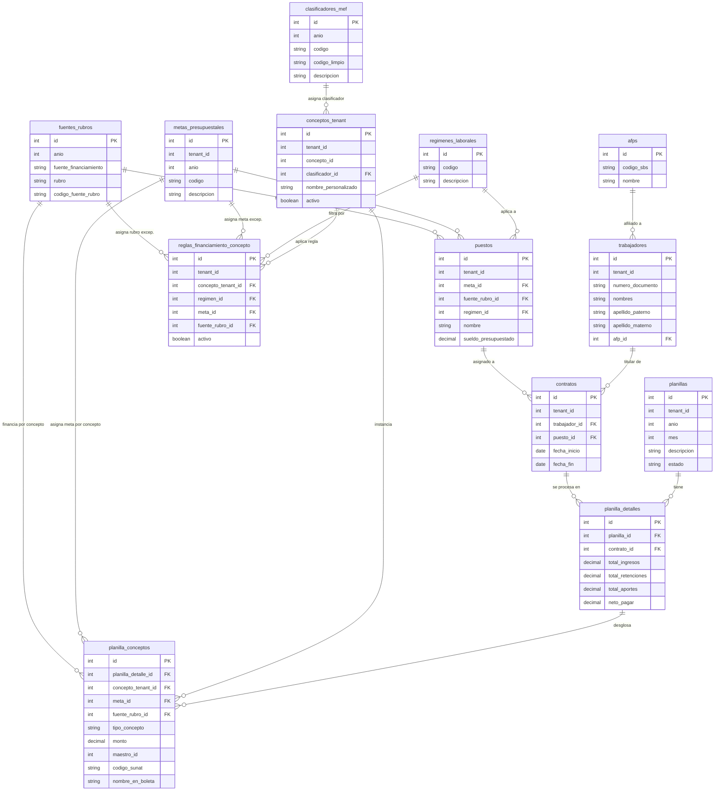

## Ideas iniciales

Estas notas describen:
1. La creación del entorno UI para las reglas de financiamiento de conceptos extraordinarios u ocasionales, otorgados por normas legales y negociaciones colectivas institucionales (que no son remunerativas)
2. La creación del entorno UI y en funcionamiento de una vista para formular las planillas extraordinarias (adicionales, especiales, extraordinarias, etc.) que pueden incluir los conceptos extraordinarios.
## Diagrama ER



## Sobre las reglas de financiamiento de conceptos extraordinarios y ocasionales
Actualmente "presupuesto anual" está inhabilitado para su implementación en una fase posterior.

### Pregunta pertinente:
**¿Es necesario el enfoque de una tabla espejo de la tabla `reglas_financiamiento_concepto` para abarcar tanto los `conceptos_modelo` (general para todos) como los `conceptos_tenant` (específico para cada municipalidad)?**  Actualmente la tabla solo "recibe" conceptos del tenant.

En principio para decretos de urgencia, leyes o normas similares que disponen la entrega de bonificaciones excepcionales las reglas para conceptos modelo son suficientes para todas las municipalidades. Sin embargo, hay conceptos propios de la municipalidad como negociaciones colectivas (pactos colectivos) que sí necesitarían reglas específicas para las municipalidades, sobre todo considerando que muchas veces se debe "rebuscar" los rubros disponibles para el financiamiento.

En conclusión es necesario adicionar una tabla de reglas de financiamiento para el módulo conceptos modelo del administrador del SaaS.

**Jerarquía de resolución en Go (Fallback):**

$$\text{Regla Tenant} \longrightarrow \text{Regla Modelo (SaaS)} \longrightarrow \text{Default del Puesto}$$

### Ideas para las reglas de financiamiento de conceptos
- Dentro de la vista `@ui\templates\admin\conceptos_modelo_ui.html` y `@ui\templates\tenant\conceptos_tenant_ui.html` dentro del grupo de acciones en la lista de conceptos, se agrega el botón "Reglas" que despliega un modal con el formulario para las reglas.
- Las reglas consideran los siguientes campos:
	1. Régimen laboral.
	2. Meta presupuestal.
	3. Fuente/Rubro.
	4. Es Activo.

>[!CAUTION]
>**Otro asunto a considerar:**
>Ya desde el punto de vista de la municipalidad, estas reglas son generales, al gestionarlo desde el módulo de conceptos (modelo o tenant) solo afecta a los grandes grupos posibles: régimen laboral, meta presupuestal y fuente/rubro; debido a que no tiene acceso desde esa interfaz a los detalles de puestos, lo cual es correcto. 
>
>**¿Esto puede complicar el flujo de cálculo si este concepto se inserta en la planilla normal a través de la estructura de costo de los puestos que contienen todos los conceptos que afectan a un puesto determinado?**
>
>No debería complicar nada si solo es aplicado al concepto extraordinario/ocasional en cuestión sin afectar ninguno de los otros conceptos ya establecidos y que naturalmente están desconectados de las normas legales que otorgan la bonificación, o las negociaciones colectivas institucionales que otorgan bonos o similares.

### Ideas para formular las planillas extraordinarias
- Dentro de la vista `@ui\templates\tenant\planillas_ui.html` en el `formulario_crear` debemos agregar un nuevo control que permita encender o apagar la propiedad "Es Extraordinaria" para la planilla a crear.
 
>[!NOTE]
>La propiedad "Es Extraordinaria" requiere la modificación de la tabla `planillas` para agregar la columna `es_extraordinaria`.

- Una vez creada la planilla "extraordinaria" se muestra en la sección de `tabla_planillas` de la vista `@ui\templates\tenant\planillas_ui.html`, y en su misma fila se muestra el botón nuevo "Formular" el cual nos debe llevar a una vista nueva que podemos llamar "planilla_especial_ui", y debe hacer "desaparecer o inhabilitar" el botón "procesar".
- La vista "planilla_especial_ui" debe contener los siguientes elementos y controles:
	- El encabezado debe indicar la descripción de la planilla (p.e.: PLANILLA DE BONIFICACIÓN DU Nº 040-2026-fake)
	- Una sección de selección de conceptos: para los conceptos tenant (todos sin restricción), pero en caso de ser un concepto extraordinario (`conceptos_tenant.es_extraordinario`) debe mostrarse un control para ingresar un monto fijo que se pueda aplicar a todos los trabajadores seleccionados. Sería excelente ayuda visual si se muestran el concepto o los conceptos seleccionados para ser aplicados a los trabajadores como una tabla preliminar.
	- Una sección de Controles de filtro para meta presupuestal, régimen laboral, unidad orgánica, condición de nombrado, permanente, o a plazo fijo, contratado.
		- Sería excelente una tabla para seleccionar uno varios trabajadores que sea el resultado de aplicar los filtros del paso anterior. Si no hay selección se aplica a todo el conjunto. Esto trae un problema: si hay cientos de trabajadores mostrarlos todos en esta parte de la vista puede ser perjudicial para el usuario y quizá pueda recargar la página.
	- Un botón que nos permita una previsualización de los trabajadores afectados y un botón para procesar la planilla e insertar los datos en la planilla_detalles; planilla_conceptos; etc.

>[!NOTE]
>La lógica de la aplicación debe realizar las consultas necesarias para identificar los contratos correctos para identificar los trabajadores activos con contratos activos que serán insertados en la estructura de las tabla de `planillas`; `planilla_detalles` y `planilla_conceptos`. Con el objetivo que los submódulos creados anteriormente para planillas como **asignar fuente/rubro**, **ver planillas** o **ver boletas** y los **anexos** se muestren correctamente.
>

>[!CAUTION]
>El botón procesar que se encuentra dentro de la vista "planilla_especial_ui" no debe ejecutar el servicio de creación de planillas "ordinarias", debe realizar los procedimientos necesarios para insertar la información indicada en la nota previa, y verificar la aplicación de las reglas de financiamiento del concepto extraordinario.

---
## Análisis de Gemini de las ideas iniciales:
Tus notas tienen una claridad conceptual y de negocio impecable (se nota el dominio de la gestión de planillas en el sector público), pero **así como está, el archivo es demasiado abarcante para pasárselo en un solo bloque a Antigravity 2.0 CLI (o cualquier agente de código)**.

Si le entregas todo este documento de golpe a un agente CLI:

1. **Perderá contexto o precisión** a mitad de la generación.
    
2. Mezclará capas (migraciones, controladores en Go, lógica de negocio y plantillas HTMX).
    
3. Podría generar código parcial, omitiendo validaciones de la BD o creando HTMX pesado.
    

Para que tu agente trabaje con **alta precisión** y tu arquitectura en Go + HTMX se mantenga limpia, debes **estructurar la implementación en 5 fases secuenciales**.

## 1. Respuesta a tu duda conceptual (Tabla Espejo `reglas_financiamiento_modelo`)

> **¿Es necesario crear una tabla espejo para los `conceptos_modelo` a nivel SaaS?**

**Sí, es 100% necesario y conveniente.**

- **Para Decretos de Urgencia / Leyes Nacionales:** El administrador del SaaS configura la regla una sola vez en `reglas_financiamiento_modelo` (ej. Bono D.U. 040-2026 $\rightarrow$ Rubro `00 Recursos Ordinarios`, Clasificador `2.1.1 ...`). Todas las municipalidades (tenants) heredan esta regla automáticamente.
    
- **Para Pactos Colectivos Localizados:** La municipalidad usa `reglas_financiamiento_concepto` para definir sus propios rubros locales (ej. Canon, RDR)[cite: 1, 2].
    

**Jerarquía de resolución en Go (Fallback):**

$$\text{Regla Tenant} \longrightarrow \text{Regla Modelo (SaaS)} \longrightarrow \text{Default del Puesto}$$

## 2. Detalle técnico y vacíos que debes precisar antes de codificar

Antes de pasar a los prompts para la CLI, deja definidos estos 3 puntos críticos:

1. **Rendimiento en la UI de Selección de Trabajadores (HTMX):**
    
    Para evitar recargar la página con cientos de trabajadores, no traigas a todos de golpe. Usa **búsqueda + paginación o filtrado reactivo con HTMX**:
    
    HTML
    
    ```
    <input type="search" name="q" 
           hx-get="/tenant/planillas/especial/trabajadores-search" 
           hx-target="#lista-trabajadores" 
           hx-trigger="keyup changed delay:300ms, search">
    ```
    
2. **Cargas Sociales y Retenciones:** Los bonos por D.U. o negociación colectiva suelen ser **no remunerativos y no pensionables**. Asegúrate de usar los flags de la tabla `conceptos_tenant` (`es_pensionable`, `es_afecto_cargas_sociales`) para que el motor de cálculo no les aplique AFP/ONP en la planilla extraordinaria.
    
3. **Migración de Base de Datos:**
    
    Falta el campo `es_extraordinaria` en `planillas` y la tabla `reglas_financiamiento_modelo`[cite: 1, 2].
    

## 3. Hoja de Ruta Dividida en Fases (Para pasar a Antigravity CLI)

Pásale a tu agente un prompt por cada fase. Una vez que apruebes la Fase 1, avanzas a la Fase 2.

### 📍 Fase 1: Migraciones y Modelos Go (Base de Datos)

**Objetivo:** Preparar la base de datos y structs de Go sin tocar UI ni controladores.

- **Prompt sugerido para Antigravity CLI:**
    

> _"Actúa como un desarrollador Go + PostgreSQL. Necesito crear dos migraciones (SQL) y actualizar los struct de modelo en Go:_
> 
> 1. _Agregar la columna `es_extraordinaria BOOLEAN DEFAULT FALSE` a la tabla `planillas`._
>     
> 2. _Crear la tabla `reglas_financiamiento_modelo` (espejo de `reglas_financiamiento_concepto`, pero vinculada a `conceptos_modelo` en lugar de `conceptos_tenant`)._
>     
> 3. _Generar o actualizar los structs Go correspondientes._ _Toma como referencia el esquema SQL provisto._"
>     

### 📍 Fase 2: UI de Reglas de Financiamiento (Modal HTMX)

**Objetivo:** Permitir gestionar las reglas desde el catálogo de conceptos (modelo y tenant).

- **Prompt sugerido para Antigravity CLI:**
    

> "Vamos a implementar el CRUD del modal de Reglas de Financiamiento para conceptos en Go + HTMX. _Requerimientos:_
> 
> - En `conceptos_modelo_ui.html` y `conceptos_tenant_ui.html`, agrega un botón 'Reglas'.
>     
> - Al hacer clic (vía `hx-get`), abre un modal HTML que carga las reglas vigentes para ese concepto.
>     
> - _Formulario dentro del modal para agregar/eliminar una regla asignando: `regimen_id`, `meta_id`, `fuente_rubro_id` y estado `activo`[cite: 1, 2]._
>     
> - _Usa HTMX para procesar el submit y refrescar el contenido del modal sin recargar la página."_
>     

### 📍 Fase 3: Creación de Planillas Extraordinarias

**Objetivo:** Permitir al usuario crear una planilla marcándola como "Extraordinaria".

- **Prompt sugerido para Antigravity CLI:**
    

> _"Modifica la vista `planillas_ui.html` y el handler de creación de planillas en Go:_
> 
> 1. Añade el checkbox 'Es Extraordinaria' en el formulario de creación (`formulario_crear`).
>     
> 2. _Guarda el campo `es_extraordinaria` en la tabla `planillas`[cite: 1, 2]._
>     
> 3. En la tabla de planillas, si `es_extraordinaria == true`, muestra el botón 'Formular' (que apunta a `/tenant/planillas/{id}/formular`) y oculta/inhabilita el botón tradicional 'Procesar'."
>     

### 📍 Fase 4: Vista "Formulador de Planilla Especial" (`planilla_especial_ui.html`)

**Objetivo:** Construir la interfaz de filtrado y selección de trabajadores + conceptos de la planilla extraordinaria.

- **Prompt sugerido para Antigravity CLI:**
    

> "Crea la vista `planilla_especial_ui.html` con arquitectura Server Driven-UI + HTMX:
> 
> - Encabezado con título/descripción de la planilla.
>     
> - _Sección 1: Selector de concepto tenant (no filtrar por `es_extraordinario` para poder seleccionar conceptos relacionados a pactos colectivos) e input para ingresar un monto fijo global[cite: 1, 2]._
>     
> - Sección 2: Controles de filtro (Meta, Régimen Laboral, Unidad Orgánica). Al cambiar los filtros, usa `hx-get` para renderizar parcialmente la lista de trabajadores coincidentes.
>     
> - _Sección 3: Tabla de vista previa de trabajadores con checkboxes para selección manual._
>     
> - Botón 'Previsualizar Afectación' que calcule el resumen de montos en pantalla sin guardar en BD."
>     

### 📍 Fase 5: Servicio Backend de Procesamiento de Planilla Extraordinaria

**Objetivo:** Desarrollar el motor en Go que inserta los registros definitivos respetando las reglas de financiamiento.

- **Prompt sugerido para Antigravity CLI:**
    

> "Crea el servicio Go para procesar definitivamente la planilla extraordinaria (al presionar 'Procesar' en `planilla_especial_ui`):
> 
> 1. Identifica los contratos activos de los trabajadores seleccionados.
>     
> 2. _Para cada trabajador, inserta su fila en `planilla_detalles`[cite: 1, 2]._
>     
> 3. _Para el concepto asignado, resuelve `meta_id` y `fuente_rubro_id` evaluando la jerarquía: Regla Tenant $\rightarrow$ Regla Modelo $\rightarrow$ Default del Puesto[cite: 1, 2]._
>     
> 4. _Inserta los registros resultantes en `planilla_conceptos`[cite: 1, 2]._
>     
> 5. Redirige a la vista normal de la planilla con el estado correspondiente para ver boletas o anexos."
>     

### Conclusión

Dividir tu proyecto en estos 5 pasos le dará a **Antigravity 2.0 CLI** tareas atómicas con contexto controlado, garantizando que el código Go generado sea mantenible y las plantillas HTMX respondan de forma fluida.

---

¿Cómo puedo asignar varios conceptos de una sola vez? ¿es conveniente poder seleccionar varios conceptos a la vez y relacionarlos a los trabajadores?

¿Es posible relacionar estos conceptos "extraordinarios" directamente en la tabla `planilla_conceptos` sin romper la lógica interna de la gestión de planillas?