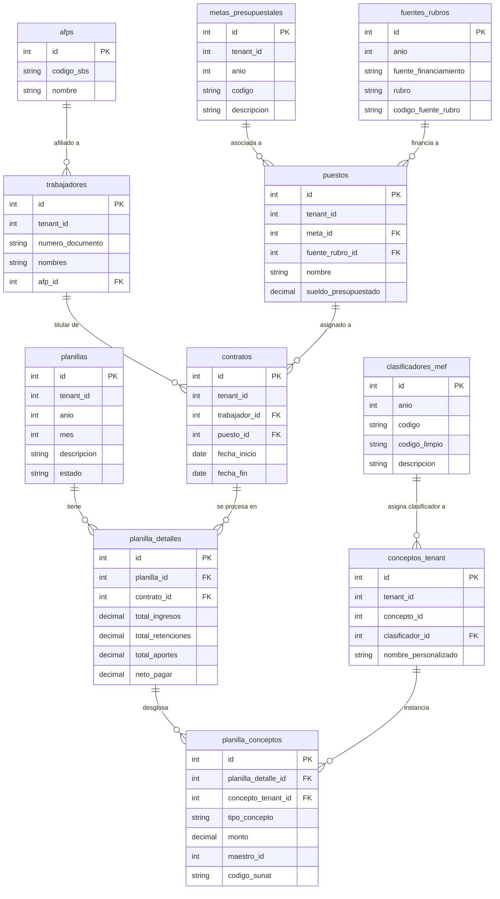
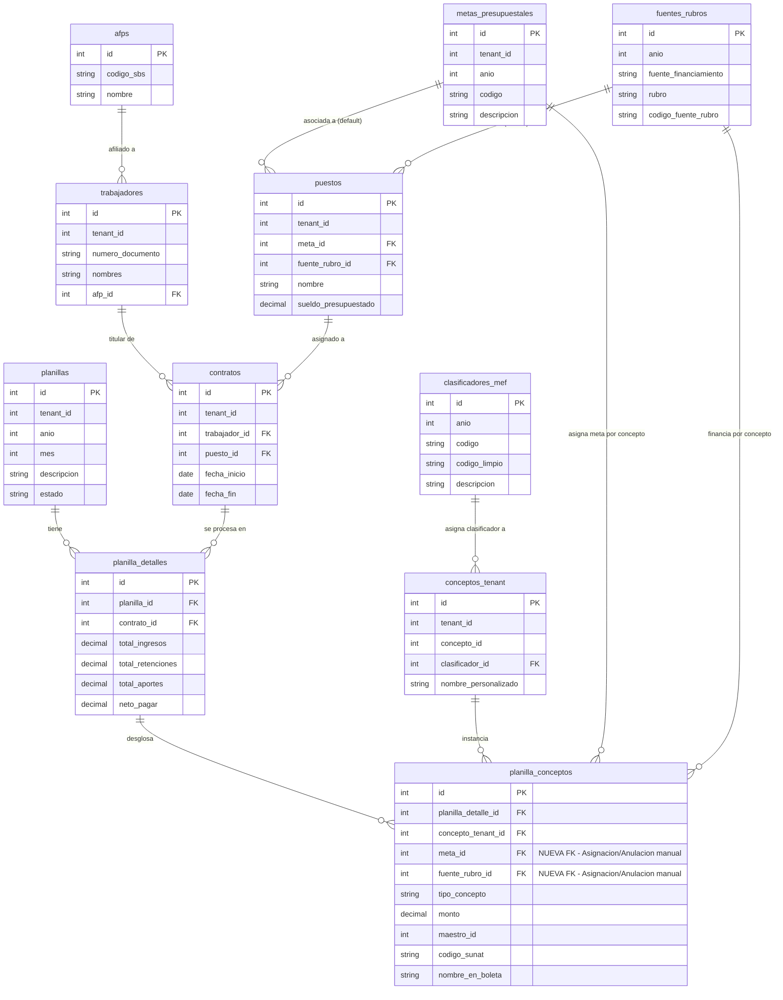

## El problema a resolver:
Actualmente la relación de los rubros de gasto con la planilla se produce a través de la tabla `fuentes_rurbos` que asigna el financiamiento a la tabla `puestos`, por lo tanto, todos los conceptos (tenant) asociados al puesto, a través de la tabla `puesto_conceptos`, deben estar asociados al rubro del puesto.

Sin embargo, la realidad de la ejecución presupuestal y el detalle de las planillas en las municipalidades hace que existan relaciones más complejas, como pueden ser:

1. Las metas (presupuestales) pueden tener más de un rubro en forma excluyente, es decir, un grupo de metas se financian con un rubro y otro grupo de metas se financian con otro rubro. Cada meta a su vez financia, en última instancia, a uno o muchos puestos. Hay otros casos, que inclusive las metas pueden estar financiadas por más de un rubro, es decir, un rubro específico pueden financiar un grupo de puestos dentro de la meta, y otro rubro específico puede financiar otro grupo diferente de puestos dentro la misma meta.
2. Existen financiamientos ocasionales del Tesoro Público que ordenan pago de gastos de personal y obligaciones sociales (varios clasificadores de gasto) con rubros específicos como pueden ser "00 recursos ordinarios" o "19 recursos por operaciones oficiales de créditos", que total o parcialmente a los conceptos (tenant) asociados a los puestos.
3. Hay ocasiones que el financiamiento procede por transferencias financieras de otras entidades similares al caso anterior.
4. Existen en los últimos años bonificaciones especiales que se financian por el rubro "00 recursos ordinarios", sin perjuicio, que pueda existir otro rubro en el futuro. Estos bonos se asocian a conceptos excepcionales con un clasificador de gasto específico y se deben aplicar a todos los trabajadores (puestos), a veces, solo a un grupo de trabajadores seleccionados por condición de nombrados o contratados, o de un determinado régimen laboral, u otros criterios que debe aplicar el gestor de recursos humanos y poder asignar el bono a los trabajadores que los cumplan.

Hay dos capas que debemos trabajar, la primera el análisis de agregar columnas para rubro y meta en `planilla_conceptos` (podemos empezar por lo más simple) y segundo analizar un entorno UI que nos permita maniobrar los diferentes casos descritos anteriormente.

## Diagrama de las tablas original



## Análisis y sugerencias de implementación
El análisis detallado que presentas describe perfectamente la complejidad real de la gestión presupuestal de personal en el sector público peruano (SIAF / MEF / Municipalidades).

Casos como **transferencias financieras excepcionales, decretos supremos de urgencia, bonos por convenio colectivo o leyes de presupuesto** exigen que la afectación presupuestal no sea rígida a nivel de puesto, sino flexible a nivel de ítem/concepto de pago.

## Análisis Técnico de las Dos Capas

### Capa 1: Modelo de Datos (`planilla_conceptos` como Snapshot Presupuestal)

Al añadir `meta_id` y `fuente_rubro_id` a la tabla `planilla_conceptos`, transformas cada fila de concepto calculado en una **unidad atómica de afectación presupuestal**.

Cada centavo procesado en la planilla se guarda de forma inmutable con la combinación exacta de:

$$\text{Fila de Concepto} \longrightarrow \text{Meta} + \text{Fuente/Rubro} + \text{Clasificador MEF} + \text{Monto}$$

#### Mecanismo de Cascada (Fallback) en el Motor de Go

Cuando tu backend en Go calcule la planilla para un periodo (`estado = 'BORRADOR'`), resolverá la asignación de Rubro y Meta aplicando la siguiente **jerarquía de prioridad**:

```Plaintext
[1. Regla Excepcional / Bono / Transferencia] 
       │ (Si existe regla específica para el concepto o grupo de trabajadores)
       ▼
[2. Valor por Defecto del Puesto] 
       │ (Toma puestos.meta_id y puestos.fuente_rubro_id)
       ▼
[3. Persistencia Inmutable]
         (Guarda meta_id y fuente_rubro_id finales en planilla_conceptos)
```

1. **Prioridad 1 (Excepción):** ¿Existe una regla activa de financiamiento para este `concepto_tenant` (ej. Bono Excepcional en Rubro `00`) o para una combinación de concepto + régimen laboral/contrato?
    
    - _Sí:_ Asigna el `fuente_rubro_id` y/o `meta_id` indicados en la regla.
        
2. **Prioridad 2 (Por Defecto):** Si el concepto no tiene ninguna regla especial, toma automáticamente la meta (`puestos.meta_id`) y el rubro (`puestos.fuente_rubro_id`) asignados al puesto del trabajador.
    
3. **Persistencia (Snapshot):** El resultado se graba en `planilla_conceptos`. Si el puesto cambia de rubro el próximo mes, la planilla de este mes permanece intacta.
    

### Capa 2: Estrategia del Entorno UI/UX para Manejo Operativo

Para que el usuario de Recursos Humanos o Presupuesto pueda maniobrar los 4 casos sin fricción, se deben diseñar **tres componentes clave en la interfaz web**:

```Plaintext
┌─────────────────────────────────────────────────────────────────────────────┐
│                       FLUJO OPERATIVO EN LA UI                              │
├─────────────────────────────────────────────────────────────────────────────┤
│ 1. CONFIGURACIÓN DE REGLAS ──► 2. PROCESAMIENTO Y ──► 3. REVISIÓN Y MUESTREO│
│    DE FINANCIAMIENTO           MALLA INTERACTIVA          EN BORRADOR       │
│    (Antes de calcular)         (Ajuste masivo)            (Validación pre)  │
└─────────────────────────────────────────────────────────────────────────────┘
```

#### A. Módulo de "Reglas de Financiamiento Excepcional" (Pre-cálculo)

Interfaz para definir excepciones antes de procesar la planilla:

- **Filtros de Aplicación:**
    
    - Por Concepto (`concepto_tenant_id`)
        
    - Por Régimen Laboral (ej. solo 276 Nombrados, 728, CAS)
        
    - Por Condición / Unidades Orgánicas / Lista de Contratos
        
- **Asignación Forzada:**
    
    - Seleccionar `fuente_rubro_id` objetivo (ej. _00 Recursos Ordinarios_)
        
    - Seleccionar `meta_id` objetivo (o mantener la meta original del puesto y solo cambiar el rubro).
        

#### B. Malla Interactiva de Conceptos (Edición Manual en Borrador)

Una vez calculada la planilla en estado `'BORRADOR'`:

- **Tabla Muestra/Grilla:** Muestra a los trabajadores con el desglose de sus conceptos, clasificadores, montos, metas y rubros.
    
- **Edición Masiva (Bulk Update):** Permitir seleccionar N registros (ej. todos los conceptos de _Bonificación Extraordinaria_) y aplicar un botón "Cambiar Rubro/Meta" para actualizar en lote los campos de `planilla_conceptos`.
    
- **Soporte para Cambio Individual:** Permitir hacer clic en la celda del Rubro/Meta de un concepto específico para cambiarlo manualmente si hay una excepción de último momento.
    

#### C. Validador y Resumen Presupuestal Pre-Cierre

Antes de pasar la planilla a estado `'CERRADA'`, la UI mostrará un **Resumen de Ejecución Presupuestal**:

- Tabla agrupada por: `Meta` + `Fuente/Rubro` + `Clasificador MEF` $\rightarrow$ `Monto Total`.
    
- Muestra de alertas: Registros sin meta/rubro asignado o inconsistencias antes de exportar interfaces al SIAF/MEF.
    

## Diagrama ER Mermaid Actualizado

Se actualizó la estructura agregando `meta_id` y `fuente_rubro_id` dentro de **`planilla_conceptos`**, estableciendo sus relaciones directas con **`metas_presupuestales`** y **`fuentes_rubros`**:



## Modificación DDL Sugerida para PostgreSQL

Para implementar la Capa 1 en tu base de datos mediante migraciones de Go (`goose`):

```SQL
-- Agregar columnas a planilla_conceptos
ALTER TABLE public.planilla_conceptos 
ADD COLUMN fuente_rubro_id integer REFERENCES public.fuentes_rubros(id) ON DELETE SET NULL,
ADD COLUMN meta_id integer REFERENCES public.metas_presupuestales(id) ON DELETE SET NULL;

-- Índices para optimizar consultas de resumenes presupuestales
CREATE INDEX idx_planilla_conceptos_rubro ON public.planilla_conceptos(fuente_rubro_id);
CREATE INDEX idx_planilla_conceptos_meta ON public.planilla_conceptos(meta_id);
```

## Comentarios adicionales
- No se debe tocar la tabla `puestos`, ya que sus campos `meta_id` y `fuente_rubro_id` son los datos por defecto que se deben de tomar en caso no existan datos de rubro y meta en `planilla_conceptos`. 
- Se deben asignar por defecto los valores que se encuentran en `puestos`. En caso `puestos` no tenga datos, se debe asignar por defecto '0000' para `meta_id` y '2.0.0.0.0.0' para `fuente_rubro_id`.
- Para los conceptos de tipo `RETENCION`, no se deben considerar las columnas `meta_id` y `fuente_rubro_id` ya que no son necesarios para este tipo de conceptos.
- Por defecto, se debe aplicar a todos los conceptos de tipo `INGRESO` y `DESCUENTO` los valores por defecto de `puestos`.
- Para conceptos de tipo `BONIFICACION` u otros que se consideren excepcionales, se debe permitir la modificación de `meta_id` y `fuente_rubro_id`.