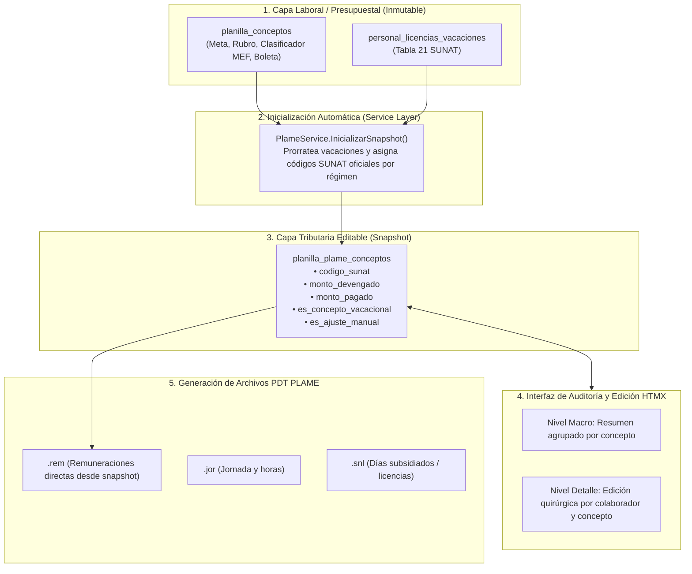

# Especificación Técnica y Arquitectura: Módulo de Auditoría y Edición a Detalle de Códigos SUNAT (PDT PLAME)

## 1. Resumen Ejecutivo y Problemática

En la gestión de planillas del sector público y privado coexisten dos dimensiones de datos con necesidades distintas:
1. **Dimensión Laboral y Presupuestal (`planilla_conceptos`)**: Fuente de verdad institucional. Cada línea está asociada a un contrato, una meta presupuestal, una fuente de financiamiento/rubro y un clasificador de gasto MEF. Alimenta las boletas de pago del trabajador, resúmenes presupuestales y los Anexos 1, 1A, 2, 2A y 3.
2. **Dimensión Tributaria Informativa (`PDT PLAME`)**: Estructura exigida por SUNAT (archivos `.rem`, `.jor`, `.snl`). Requiere clasificaciones de la Tabla 22, desagregación o consolidación de conceptos por descanso vacacional (códigos 2007, 2043, 2049, etc.), discriminación entre montos devengados y pagados, y posibles desdoblamientos tributarios de un mismo concepto laboral.

### Problemas del Modelo Anterior:
- **Sobreescritura oculta en memoria**: El servicio de exportación (`plame_service.go`) modificaba en tiempo de ejecución los códigos y montos de vacaciones al vuelo, provocando que lo auditado en pantalla no coincidiera con el archivo `.rem` descargado.
- **Granularidad exclusivamente masiva**: Si se cambiaba un código SUNAT, se aplicaba a todos los trabajadores de la planilla. No permitía afinamientos individuales por colaborador ni desdoblamientos proporcionales a distintos códigos SUNAT.
- **Riesgo de colisión presupuestal**: Intentar desdoblar o insertar líneas vacacionales directamente en `planilla_conceptos` rompería los reportes presupuestales (SIAF/MEF) y alteraría las boletas de pago.

---

## 2. Arquitectura de la Solución: Snapshot Tributario Complementario

Para lograr total libertad de edición sin comprometer la integridad presupuestal ni laboral, se establece el patrón de **Tabla Complementaria / Snapshot Tributario** (`planilla_plame_conceptos`).



---

## 3. Modelo de Datos: `planilla_plame_conceptos`

```sql
CREATE TABLE IF NOT EXISTS planilla_plame_conceptos (
    id SERIAL PRIMARY KEY,
    planilla_id INT NOT NULL REFERENCES planillas(id) ON DELETE CASCADE,
    planilla_detalle_id INT NOT NULL REFERENCES planilla_detalles(id) ON DELETE CASCADE,
    trabajador_id INT NOT NULL REFERENCES trabajadores(id) ON DELETE CASCADE,
    
    -- Vínculo opcional con la fila de origen (NULL si es línea vacacional consolidada o ajuste manual nuevo)
    planilla_concepto_id INT REFERENCES planilla_conceptos(id) ON DELETE SET NULL,
    
    -- Clasificación tributaria SUNAT (Tabla 22)
    codigo_sunat VARCHAR(10) NOT NULL,
    descripcion_sunat VARCHAR(255),
    tipo_concepto VARCHAR(20) NOT NULL, -- INGRESO, DESCUENTO, APORTE_TRABAJADOR, APORTE_EMPLEADOR
    
    -- Valores monetarios requeridos por PDT PLAME
    monto_devengado NUMERIC(12, 2) NOT NULL DEFAULT 0.00,
    monto_pagado NUMERIC(12, 2) NOT NULL DEFAULT 0.00,
    
    -- Flags de trazabilidad y auditoría
    es_concepto_vacacional BOOLEAN NOT NULL DEFAULT FALSE,
    es_ajuste_manual BOOLEAN NOT NULL DEFAULT FALSE,
    observacion_ajuste TEXT,
    
    created_at TIMESTAMP WITH TIME ZONE DEFAULT CURRENT_TIMESTAMP,
    updated_at TIMESTAMP WITH TIME ZONE DEFAULT CURRENT_TIMESTAMP
);

CREATE INDEX idx_plame_conceptos_planilla ON planilla_plame_conceptos(planilla_id);
CREATE INDEX idx_plame_conceptos_detalle ON planilla_plame_conceptos(planilla_detalle_id);
CREATE INDEX idx_plame_conceptos_trabajador ON planilla_plame_conceptos(trabajador_id);
CREATE INDEX idx_plame_conceptos_cod_sunat ON planilla_plame_conceptos(planilla_id, codigo_sunat);
```

---

## 4. Gestión de Casos Especiales Contables

### Caso A: Trabajador con Vacaciones y Múltiples Ingresos Prorrateados
1. El motor lee los ingresos remunerativos desde `planilla_conceptos` del trabajador.
2. Identifica los días de descanso vacacional (ejemplo: 15 días en un mes de 30 días = 50%).
3. Por cada concepto remunerativo ordinario:
   - Inserta una fila en `planilla_plame_conceptos` con el 50% del monto bajo su código SUNAT original (ej. `0121`).
4. Suma el 50% restante de todos los conceptos remunerativos y genera **una única fila consolidada**:
   - `codigo_sunat`: `2043` (para CAS DL 1057), `2007` (para DL 276 / DL 728) o `2049` (para Ley 30057 SERVIR).
   - `es_concepto_vacacional`: `true`.
   - `monto_devengado` y `monto_pagado`: Sumatoria exacta de los saldos prorrateados.
5. El contador puede revisar y ajustar montos si existe alguna precisión técnica adicional.

### Caso B: Desdoblamiento de un Concepto a Múltiples Códigos SUNAT
1. En `planilla_conceptos` se mantiene una única fila (ej: *Bono Extraordinario S/ 1,000.00*).
2. En `planilla_plame_conceptos` el contador puede desdoblar dicha asignación en 2 o más filas:
   - Fila 1: `codigo_sunat: "0121"`, Devengado: S/ 600.00, Pagado: S/ 600.00.
   - Fila 2: `codigo_sunat: "0122"`, Devengado: S/ 400.00, Pagado: S/ 400.00.
3. Al exportar el `.rem`, se generan las dos líneas independientes para el trabajador, manteniendo la boleta y el presupuesto completamente limpios.

### Caso C: Monto Devengado vs Monto Pagado Diferenciado
- La tabla almacena explícitamente ambas columnas. Si un concepto fue devengado en el mes pero se pagará en el siguiente (o viceversa), el contador puede editar el valor de `monto_pagado` o `monto_devengado` directamente desde la interfaz de detalle.

---

## 5. Matriz de Componentes e Interacciones

| Capa | Componente | Responsabilidad |
| :--- | :--- | :--- |
| **Repositorio** | `PlanillaRepository` / `PlameRepository` | Consultas CRUD a `planilla_plame_conceptos`, agregaciones agrupadas y seed de inicialización. |
| **Servicio** | `PlameService` | Orquestación de reglas de negocio, prorrateos vacacionales por régimen, validaciones de auditoría y generación de streams de archivos `.rem`, `.jor`, `.snl`, `.zip`. |
| **Handler** | `PlanillaHandler` | Enrutamiento HTTP, parsing de parámetros tenant/planilla y renderizado Server-Driven HTMX. |
| **Plantillas** | `planilla_sunat_codigos_ui.html`<br/>`modal_plame_trabajador_detalle.html` | UI responsiva con Pico.css v2, filtros reactivos, modales semánticos `<dialog>` y drawers de edición individual. |
